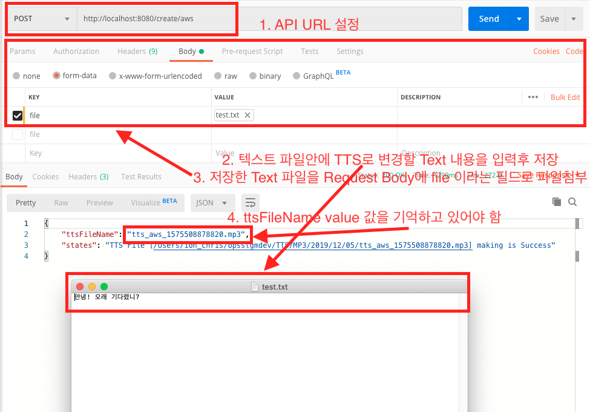
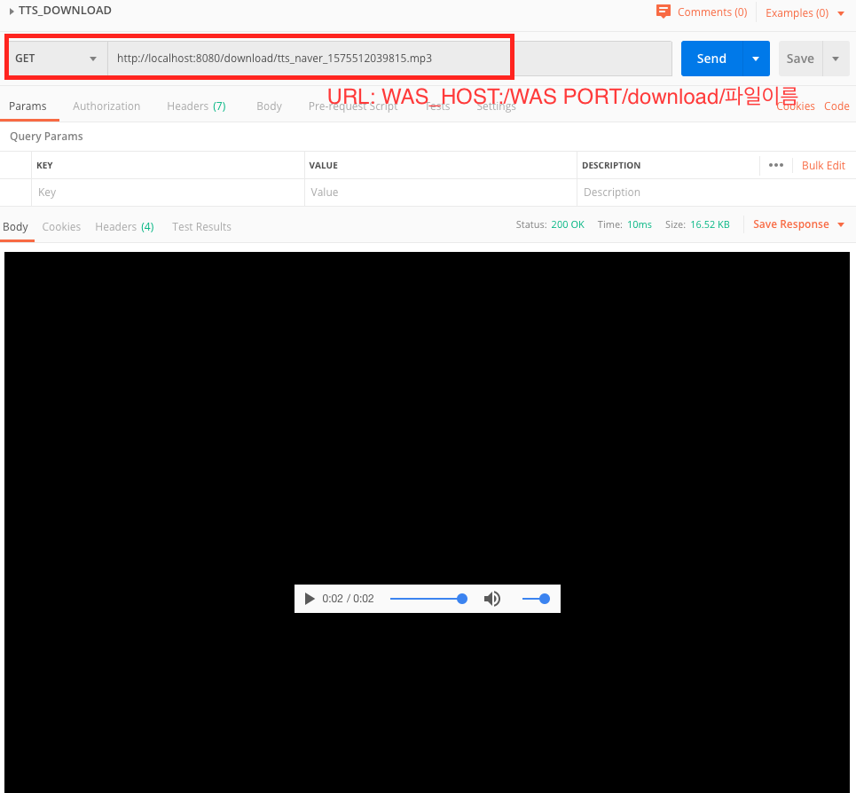

# TTS_PLATFORM_API

## 프로젝트를 만들게 된 계기
현재 SBS 콘텐츠 관리 시스템을 확장개발하는 프로젝트에 참여하고 있는데, 프로젝트 기능 개발 중 하나가 TTS 기능을 개발이었습니다.
TTS에 대한 지식이 아무것도 없었고, 공부를 해야 하는 입장이었기 때문에 시제품을 먼저 만들어서 개발에 대한 윤곽이 필요했습니다.
해당 프로젝트를 만들게 된 이유는 TTS를 만들때 어떤 세부 기능이 필요하고 과정을 걸쳐서 개발해야 하는지에 필요때문에 만들게 되었습니다.

## TTS란?
TTS(Text To Speech)의 약자로 텍스트 테이터를 읽어서 음성 데이터로 전환하는 기술을 말합니다.
해당 애플리케이션의 경우 txt 확장자 파일 안에 있는 텍스트 문자를 읽어서 음성 MP3 파일을 결과물로 얻을 수 있습니다 

## TTS 프로젝트를 개발하기 위해 해야 하는 사전 준비
AWS,GOOGLE, NAVER 와 같은 IT CLOUD PLATFORM에서 TTS API를 제공합니다.
해당 API를 사용하기 위해서는 먼저 3사의 클라우드 플랫폼의 계정이 필요합니다.
또한 계정이 있다면 플랫폼 서비스에서 TTS에 해당하는 API인증키를 발급받아야 합니다.
그리고 API 사용하는 방식을 이해하기 위해서 각 플랫폼에서 제공하는 예제 코드를 학습하시면 됩니다
다만, 해당 애플리케이션 예제 안에도 다루고 있기 때문에 각 TtsService 인터페이스를 상속받은 클래스 파일을
찾아보시면 플랫폼 인증, API 호출 전 설정등을 알 수 있습니다.

## TTS_PLATFORM_API 동작 설명
저의 경우 웹서버를 띄우고 txt 텍스트 파일과 TTS type(aws, google, naver)을 TTS 파일 생성 API에 넘기면
해당 플랫폼으로 부터 만들어진 TTS MP3 파일을 받아오고, 해당 MP3 파일 이름을 key값으로 MP3 파일 경로를
value값으로 저장하고, key값인 MP3 파일 이름으로 download를 시도하면 다운되는 기능을 해당 프로젝트에서 구현하였습니다

## TTS API 구현에 필요한 내용
대략적인 절차는 다음과 같습니다

### 1) 플랫폼 선택(aws, google, ncp)
TtsService라는 인터페이스를 구현후 이를 상속하여 AwsTtsService, GoogleTtsService, NaverTtsService
구현하였습니다. ttsType 값을 받아서 TtsService 변수에 주입하는 방식을 채택하였습니다.

### 2) 플랫폼 인증
TtsService 인터페이스에서 정의한 Run 메소드에서 인증방식과 입력값을 설정하였습니다.
각 플랫폼 인증 방식은 다음과 같습니다 
<pre>
AWS, Naver: id, pw(저는 accessKey, secreKey로 표현했습니다)
Google: 자체 인증 파일을 제공하기 때문에 해당 파일을 읽어오도록 구현했습니다
</pre>

### 3) TTS MP3 파일 생성에 필요한 파라미터 값
설정 값에는 다음과 같은 내용이 있습니다.
<pre>
3-1) Text: 문자 * 필수
3-2) 목소리(aws, naver) * 필수
3-3) 언어(google) * 필수
3-4) 성별(google) * 필수
3-5) 그외: 속도, 음의 높낮이 <- 해당내용은 구현에 없습니다
</pre>

### 4) TTS MP3 저장하는 방식
각 플랫폼마다 MP3를 저장하는 방식이 다르기때문에 {플랫폼타입}CreateMp3File()로 메소드를 만들어서 구현하였습니다
소스의 위치는 CommonService 안에 있습니다

### 5) 이외 나머지 내용
RestController 구현, MP3 파일 이름과 경로로 json 화 파일에 key, value로 경로 관리, Mp3 파일 다운로드 등등의
내용들이 들어있습니다.

## 프로젝트 사용하기 위한 환경설정
#### application.properties 내용변경
application.properties을 열면 아래와 같은 내용들이 있습니다
<pre>
apikey.path=/Users/m05214_jonghoon/security/
apikey.google.filename=google_credential_info.json
apikey.aws.filename=aws_credential_info.json
apikey.naver.filename=ncp_credential_info.json
textFile.path=/Users/m05214_jonghoon/TTS/TEXT/
ttsFile.path=/Users/m05214_jonghoon/TTS/MP3/
ttsFile.info.manage.path=/Users/m05214_jonghoon/TTS/info.json
</pre>
이 내용 중 "apikey.path", "textFile.path", "ttsFile.path", "ttsFile.info.manage.path" 에 대한
경로를 사용하실 PC의 경로로 바꾸어 놓으셔야합니다
<pre>
application.properties 설명
apikey.path: 인증키가 있는 경로
apikey.google.filename: 구글 tts Api 인증키 파일 이름입니다 
apikey.aws.filename: AWS tts Api 인증키 파일 이름입니다 
apikey.naver.filename: NCP tts Api 인증키 파일 이름입니다 
textFile.path: 첨부한 파일을 저장한 경로
ttsFile.path: 플랫폼으로 부터 받은 TTS MP3 파일이 저장된 경로
ttsFile.info.manage.path: TTS MP3 파일이름과 파일 경로에 대한 데이터를 저장한 파일위치
</pre>

#### 인증파일에 대한 내용 입력
src/main/resources/ 경로 아래 보시면 sample_credential_info(aws,ncp).json과
sample_credential_info(google).json 파일이 있습니다
1) GCP(Google Cloud Platform)에서 TTS에 대한 인증키 신청을 하면 인증에 대한 파일을 다운받을 수 있습니다
해당 파일 내용이 sample_credential_info(google).json의 필드값만 일치합니다
해당 파일을 "google_credential_info.json" 이름으로 바꾸어주시고 application.properties에서
apikey.path 경로에 입력한 폴더 아래에 넣어주시면 됩니다
2) AWS, Naver(NCP: Naver Cloud Platform)에서 인증키를 신청한 경우 ID와 패스워드 처럼
accessKey와 secretKey에 대한 정보를 얻을 수 있습니다. 해당 정보를
sample_credential_info(aws,ncp).json파일을 열어서 "사이에 넣어주시면 됩니다
<pre>{"secretKey":"","accessKey":""}</pre>
해당정보입력이 완료되었습니다 AWS의 경우 "aws_credential_info.json", Naver는 "ncp_credential_info.json"로 파일 이름변경을 합니다
그리고 apikey.path 경로 폴더 아래 해당 파일을 이동시킵니다

#### JDK 1.8설치
해당 내용은 "JDK 1.8" 로 구글링하면 많은 내용이 있습니다 설치가 되지 않으신 분들은 설치를 진행하여주세요

## 프로젝트 실행
### IDE를 이용한 실행
저는 JetBrain 사의 Intellij 라는 IDE를 사용합니다. 프로젝트 트리창에서 DemoApplication파일 우클릭후 Run하면 실행됩니다

### java 명령어를 이용한 실행
Gradle 명령어를 이용하여 Build를 하거나 또는 Intellij를 이용하여 build하면
프로젝트 경로 아래 build/libs/demo-0.0.1-SNAPSHOT.war 라는 파일이 
생성됩니다 terminer에서 해당 경로로 이동후 java -jar demo-0.0.1-SNAPSHOT.war 입력하면 프로젝트가 실행됩니다

## API 설명
실행은 포스트맨에서 진행합니다.
 
포스트맨 홈페이지:
https://www.getpostman.com/downloads/
### TTS 생성

#### 1.API URL 설정
Method는 POST 방식입니다
http://{WAS IP: WAS PORT NUMBER}/create/{tts_type}
 
tts_type -> google, aws, naver
 
예시
<pre>
http://localhost:8080/create/aws
http://localhost:8080/create/google
http://localhost:8080/create/naver
</pre>

#### 2. 텍스트 파일안에 TTS로 변경할 Text 내용을 입력후 저장
#### 3. 저장한 Text 파일을 Request Body에 file이라는 필드로 파일첨부
#### 4. Api Response 값 필드 중 ttsFileName의 value 값 내용 따로기억하기
-> 다운로드 때 키값으로 사용
### TTS 다운로드

Method는 Get 방식입니다
http://{WAS IP: WAS PORT NUMBER}/download/{tts의 파일 이름}

